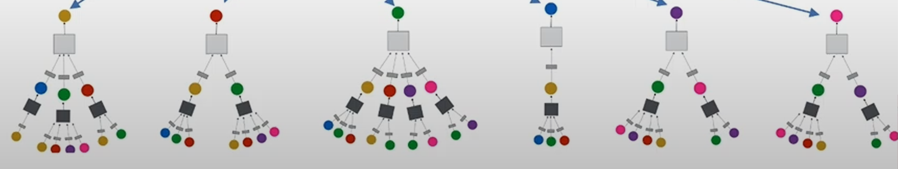

# MF (Matrix Factorization)
- Phân tách ma trận tương tác 

# Centralized Recommendation (CenRec)
` Thực thi trên server `
- Thu thập dữ liệu người dùng (sở thích, hành vi, đánh giá)
- Tiền xử lý dữ liệu
- Lựa chọn mô hình (MF, NCF, SGL)
- Huấn luyện mô hình + đánh giá & tối ưu hóa
- Triển khai để đề xuất dựa trên dữ liệu mới

# Federated Recommendation (FedRec)
1. `Khởi tạo mô hình`: Máy chủ trung tâm khởi tạo mô hình học máy 
2. Gửi mô hình tới các clients tham gia
3. Huấn luyện trên dữ liệu cục bộ
4. Sau đó mỗi client sẽ gửi tham số mô hình hoặc trọng số sau khi huấn luyện trở lại máy chủ (không gửi dữ liệu gốc)
5. Máy chủ tổng hợp bằng tính toán trung bình các tham số hoặc các kỹ thuật khác
6. Lặp lại từ bước 2 -> 5

    ## PFedRec (P - Personalized)
    - Biến thể của FedRec

### baseline
- Là `điểm chuẩn để so sánh`. 
- Ở đây nó là các mô hình đề xuất ở 2 nhóm `FedRec` và `CenRec`.

# GNN
- Là 1 dạng Deep Learning để cải thiện việc dự đoán trên đồ thị.
- Mục đích chính là mỗi node sẽ có 1 embedding chứa thông tin của các node xung quanh nó.
- Có 2 loại chính:
    + GCN (Graph Convolutional Network)
    + Graph Auto-Encoder Network

    ## GCN
    - Mỗi node sẽ định nghĩa ra 1 graph riêng của nó. 
    - Thực hiện phép tích chập lặp đi lặp lại, tổng hợp các đặc điểm của node lân cận thành biểu diễn mới của node mục tiêu
    - 
    - Từ đó với nodes input có thể dự đoán được embedding vector của node gốc.

        ### LightGCN
        + GCN sử dụng hàm kích hoạt phi tuyến tính (ReLu hoặc Sigmoid) sau mỗi layer. LightGCN chỉ giữ phép cộng trọng số đơn giản.

        + LightGCN kết hợp vecto embedding ở tất cả các layer, GCN chỉ sử dụng ở layer cuối.

        + Loại bỏ các ma trận trọng số W1, W2

